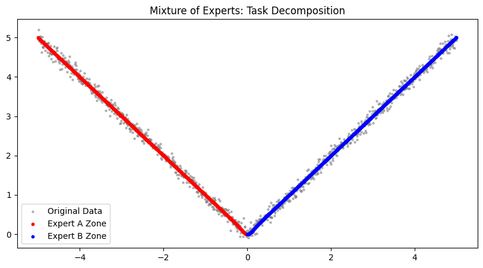
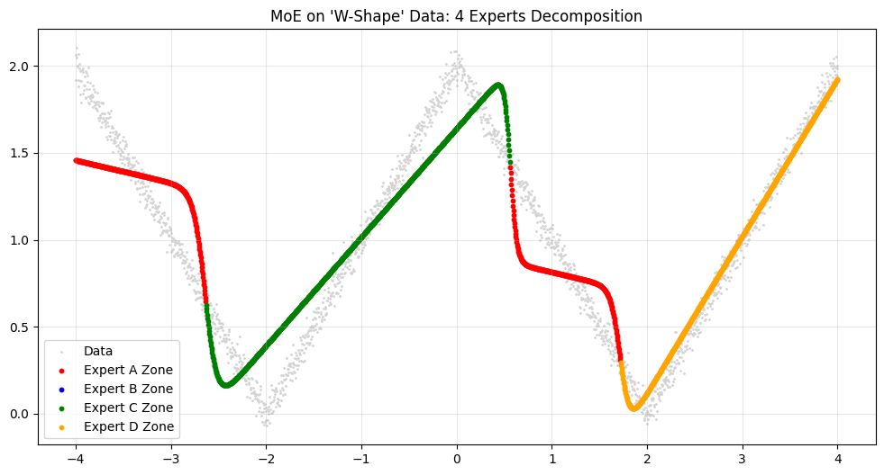

# PyTorch Implementation of Adaptive Mixtures of Local Experts (MoE)

> **"If you have a big problem, divide it into smaller ones and let experts solve them."**

This repository contains a PyTorch implementation of the classic paper **"Adaptive Mixtures of Local Experts" (Jacobs et al., 1991)**. It demonstrates how a neural network can learn to decompose complex tasks into simpler sub-tasks using a competitive learning mechanism.

## 📌 Introduction

Unlike traditional ensemble methods that average the outputs of all models, **Mixture of Experts (MoE)** uses a **Gating Network** to dynamically select or weight the most competent expert for a given input region.

This project implements the MoE architecture from scratch and verifies its **Task Decomposition** capability using non-linear regression tasks (V-Shape and W-Shape data).

## 🧠 Theory & Methodology

### 1. Architecture
[cite_start]The model consists of two main components sharing the same input [cite: 60-83]:
* **Expert Networks ($E_i$):** $N$ independent neural networks that specialize in different regions of the input space.
* **Gating Network ($G$):** A network that outputs a probability distribution (via Softmax) over the experts, deciding which expert to trust.

### 2. Competitive Learning (The Loss Function)
To encourage specialization (competition), we use the **Negative Log-Likelihood (NLL)** of a Gaussian Mixture Model instead of simple MSE.

$$E = - \log \sum_{i} p_i e^{-\frac{1}{2} || \mathbf{d} - \mathbf{o}_i ||^2}$$

* $\mathbf{d}$: Target (Ground Truth)
* $\mathbf{o}_i$: Output of Expert $i$
* $p_i$: Probability assigned by the Gating Network

### 3. Gradient & Winner-Take-All
The gradient of this loss function includes a **Posterior Probability** term:

$$\frac{\partial E}{\partial \mathbf{o}_i} = - \left[ \frac{p_i e^{-\frac{1}{2}||\dots||}}{\sum_j p_j e^{-\frac{1}{2}||\dots||}} \right] (\mathbf{d} - \mathbf{o}_i)$$

* **Mechanism:** If an expert performs well (small error), its posterior probability increases.
* **Effect:** The gradient update is weighted by this probability. [cite_start]The "winner" receives a strong learning signal, while "losers" receive almost zero gradient, leading to **efficient task decomposition** [cite: 53-55].

## 🛠️ Implementation Details

The core logic lies in the custom loss function that implements the competitive dynamics.

```python
class MoELoss(nn.Module):
    def forward(self, expert_outputs, gate_probs, target):
        # 1. Squared Error for each expert
        squared_error = (target.unsqueeze(1) - expert_outputs).pow(2).sum(dim=2)
        
        # 2. Convert to Gaussian Likelihood
        likelihood = torch.exp(-0.5 * squared_error)
        
        # 3. Weighted Sum by Gating Probabilities
        weighted_likelihood = (gate_probs * likelihood).sum(dim=1)
        
        # 4. Negative Log-Likelihood
        loss = -torch.log(weighted_likelihood + 1e-8)
        return loss.mean()
```
## 🧪 Experiments & Results

### Case 1: V-Shape Data (2 Experts)
* **Task:** Fit a V-shaped function ($y=|x| + \text{noise}$).
* **Configuration:** 2 Linear Experts.
* **Result:** The model perfectly splits the task. One expert handles the left slope ($x<0$), and the other handles the right slope ($x>0$).


*(Fig 1. Red and Blue dots represent data points assigned to Expert A and Expert B, respectively.)*

### Case 2: W-Shape Data (4 Experts)
* **Task:** Fit a W-shaped function (Double V).
* **Configuration:** 4 Experts.
* **Result:** The experts automatically divide the domain into 4 distinct linear segments.


*(Fig 2. Four experts (Red, Blue, Green, Orange) successfully decomposing the W-shape function.)*

## 📈 Performance Tuning Guide

Based on experiments, here are strategies to improve MoE performance:

| Priority | Strategy | Mechanism | Implementation |
| :---: | :--- | :--- | :--- |
| **1** | **Increase Capacity** | Allow experts to learn non-linear patterns (Curves vs Lines). | `nn.Linear` $\to$ `nn.Sequential(Linear, ReLU, Linear)` |
| **2** | **Optimizer Schedule** | Reduce learning rate near convergence for fine-tuning. | `torch.optim.lr_scheduler.StepLR` |
| **3** | **Scale Up** | Increase `num_experts` for highly complex data (e.g., "WW" shape). | `MoE(num_experts=8)` |
| **4** | **Learn Variance** | Allow experts to output confidence ($\sigma$), sharpening the competition. | Custom Gaussian PDF Loss |

## 🚀 How to Run

1. **Clone the repository:**
   ```bash
   git clone [https://github.com/YOUR_USERNAME/MoE-toy-implementation.git](https://github.com/YOUR_USERNAME/MoE-toy-implementation.git)
   cd MoE-toy-implementation
   ```
   
2. **Install dependencies:**

    ```bash
    pip install torch matplotlib numpy
    ```

3. **Run the training script:**
    Case 1: V-Shape Data (2 Experts)
    ```bash
    python train_v_shape.py
    ```
    Case 2: W-Shape Data (4 Experts)
   ```bash
   python train_w_shape.py
    ```
   
📚 References
Paper: Jacobs, R. A., Jordan, M. I., Nowlan, S. J., & Hinton, G. E. (1991). Adaptive Mixtures of Local Experts. Neural Computation.
